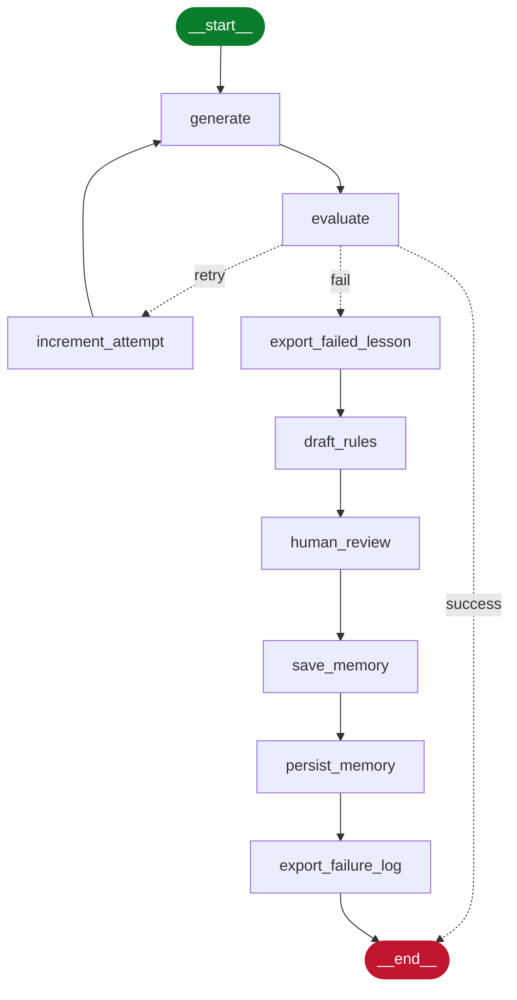

# Lesson Generation & Evaluation Pipeline

A LangGraph workflow that generates a lesson, evaluates it against a rubric, and gets smarter with every run - each repeated failure becomes a human-approved rule for future runs. The example lesson here covers an introduction to RAG (retrieval-augmented generation).

## Why this exists

A plain "regenerate until it passes" loop wastes compute repeating the same mistake and learns nothing. This project closes that loop: repeated failures become a candidate rule, a human approves it, and it's stored for future runs.

## Architecture



Dashed edges out of `evaluate` are the conditional routing (`success` / `retry` / `fail`); solid edges are direct, unconditional transitions — matching how LangGraph itself distinguishes `add_conditional_edges` from `add_edge`.

Every run is traced end-to-end in Langfuse. State is checkpointed to MongoDB, so a run can pause at the `human_review` `interrupt()` and resume exactly where it left off.

## Tech stack

| Concern | Choice |
|---|---|
| Workflow orchestration | LangGraph |
| Checkpointing | LangGraph's MongoDB checkpointer |
| LLM (generation + evaluation) | Local Ollama chat model |
| Embeddings | `nomic-embed-text` |
| Rule memory | Qdrant (separate generation / evaluation collections) |
| Run + rejection log | MongoDB Atlas |
| Tracing / observability | Langfuse (local) |
| Data validation | Pydantic |
| Human-in-the-loop | LangGraph `interrupt()`, terminal-based approval |

## How it works

### 1. Generate (`generate`)

Pulls approved **generation rules** for the topic from Qdrant, then prompts Ollama for a structured `Lesson` object (see [lesson schema](./lesson_schema.py)). Retries also get `regeneration_instructions` from the last failed evaluation.

### 2. Evaluate (`evaluate`)

Scores the `Lesson` against the rubric, pulling **evaluation rules** from Qdrant the same way. Returns an `EvaluationResult` with pass/fail per criterion and targeted feedback.

### 3. Retry (`increment_attempt`)

If it fails within budget (`max_retries`, capped at 1–2), `increment_attempt` bumps the retry counter and loops back into `generate` with `regeneration_instructions`.

### 4. Rule drafting + human review (`export_failed_lesson` → `draft_rules` → `human_review`)

Once retries are exhausted, `export_failed_lesson` saves the failing lesson, and `draft_rules` proposes candidate rules from the accumulated rejections. `human_review` then pauses on a LangGraph `interrupt()` so a human can approve, edit, or reject each draft.

### 5. Persisting memory (`save_memory` → `persist_memory`)

Approved rules are embedded with `nomic-embed-text` and written to the matching Qdrant collection across these two nodes, tagged by topic. Future runs on that topic retrieve them automatically.

### 6. Failure log (`export_failure_log`)

The full rejection log for the run is exported to PDF as the last step before `__end__`.

### Threads and checkpointing

Each user gets their own `thread_id`, so the MongoDB checkpointer keeps separate, resumable state per user — including across the `interrupt()` pause.

## Getting started
 
### Prerequisites
 
- Python 3.11+
- Ollama running locally with a chat model pulled, plus `nomic-embed-text` for embeddings
- A reachable Qdrant instance and a MongoDB Atlas connection string
- A local Langfuse instance for tracing
### Install
 
```bash
git clone <repo-url>
cd <repo-name>
python -m venv .venv && source .venv/bin/activate
pip install -r requirements.txt
```
 
### Run local services
 
Pull and serve the models Ollama needs:
 
```bash
ollama pull llama3
ollama pull nomic-embed-text
ollama serve
```
 
Start Qdrant with Docker:
 
```bash
docker run -p 6333:6333 -v qdrant_storage:/qdrant/storage qdrant/qdrant
```
 
Start Langfuse locally with Docker Compose:
 
```bash
docker compose -f docker-compose-langfuse.yml
```
 
MongoDB defaults to Atlas, but a local container works fine for dev too: `docker run -p 27017:27017 mongo`.
 
### Configure
 
Copy `.env.example` to `.env` and fill in the values below. `settings.py` reads only from the environment, so nothing production-specific is hardcoded.
 
```
OLLAMA_BASE_URL=
OLLAMA_MODEL=
QDRANT_URL=
QDRANT_API_KEY=
MONGODB_URI=
LANGFUSE_HOST=
LANGFUSE_PUBLIC_KEY=
LANGFUSE_SECRET_KEY=
MAX_RETRIES=2
```
 
### Run
 
```bash
python main.py --topic "Introduction to RAG" --user-id <user-id>
```

`--user-id` sets the LangGraph `thread_id`, so multiple users get separate, resumable checkpoints. When `human_review` hits its `interrupt()`, the terminal prompts for approve/edit/reject on each draft rule.

## Limitations

- The retry budget is capped at 1–2 by design, so a persistent failure falls through to human review rather than looping indefinitely.
- Rule quality depends on the human reviewer — a bad approval can propagate into future generations until someone corrects it.
- There's no automated test suite yet; validation currently happens by running the pipeline end-to-end.

## Contributing

This started as a solo project rather than a maintained open-source repo, so there's no formal process yet. Issues and PRs are welcome if you find it useful.
